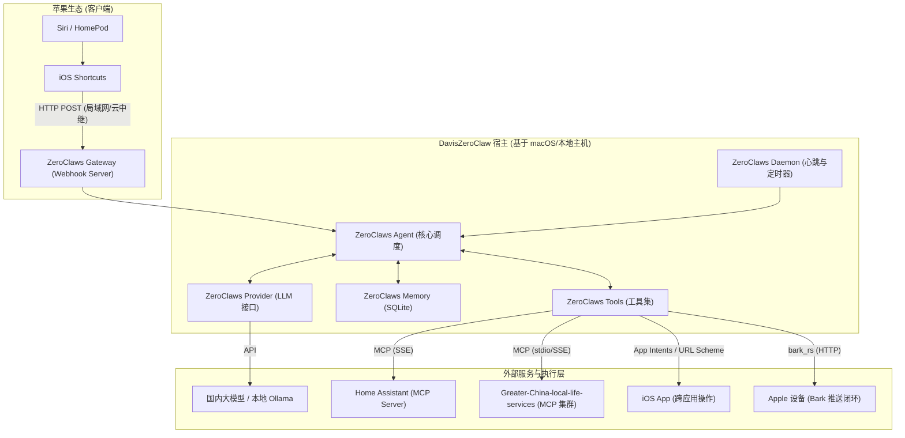

# DavisZeroClaw 系统架构设计

## 1. 架构概览

DavisZeroClaw 采用“本地优先”的混合架构，核心业务逻辑完全建立在 **ZeroClaws** 的 trait-driven（特征驱动）架构之上。系统将 ZeroClaws 原生的基础组件与家庭智能管家的具体场景进行了深度映射。

## 2. 核心组件映射与职责

### 2.1 ZeroClaws Gateway (通信接入层)
- **职责**：充当系统的“耳朵”。在本地启动 HTTP 服务（如端口 3000），专职监听来自 iOS Shortcuts 的 Webhook 请求。
- **异步解耦机制**：为避免 Siri 快捷指令严格的 10-60 秒 HTTP 超时报错，Gateway 在收到请求并完成鉴权后，**立即返回 `200 OK`**（让 Siri 提示“正在处理”）。随后利用 Rust 的 Tokio 异步运行时，将繁重的推理与控制任务推入后台队列，彻底实现前后端解耦。
- **安全机制**：在 Webhook 请求头中校验预设的局域网 Token，防止未经授权的内网调用。

### 2.2 ZeroClaws Provider (模型决策层)
- **职责**：充当系统的“大脑”。负责意图识别、参数提取和工具选择。
- **配置**：配置为兼容 OpenAI 接口格式的 Provider（例如 DeepSeek API, 通义千问 API），确保在国内网络环境下低延迟、稳定响应。

### 2.3 ZeroClaws Tools (能力执行层)
- **职责**：充当系统的“手脚”。将外部系统的接口封装为 Agent 可调用的标准化工具，并支持 **MCP (Model Context Protocol)** 协议。
- **主要实现**：
  - **Home Assistant 连接器 (MCP Client)**：DavisZeroClaw 宿主作为 MCP Client，通过 SSE 协议连接 HA 官方的 MCP Server。这使得 Agent 能自动发现所有暴露的实体并调用相关 Service，无需手动编写 Tool 定义。
  - **大中华区生活服务 (MCP 集群)**：直接接入开源的 `Greater-China-local-life-services` MCP 节点群，以零维护成本瞬间点亮包含美团、饿了么、顺丰、12306 等 40+ 本土服务的查询与控制能力，彻底弃用自行抓取 API 的传统模式。
  - `ShortcutCallbackTool` / `PushNotificationTool`：利用成熟的 Rust 库 `bark_rs`，将执行结果或 App Intents 深度跳转链接（URL Scheme）异步推送到用户的 iPhone，完成交互闭环。
  - `ComputerUseTool` (V2.0 规划)：桌面视觉自动化引擎。不再依赖低效的纯像素识别，而是引入类似 `Screen2AX` 的技术，将 macOS 界面或“iPhone 镜像”转化为类似网页 DOM 的“无障碍树”结构，交由轻量级视觉大模型（如 GLM-4.6V-Flash）在安全的沙箱内进行极速、精准的物理操作。

### 2.4 ZeroClaws Memory (状态与上下文层)
- **职责**：充当系统的“海马体”。
- **实现**：使用本地 SQLite 数据库。
  - **短期记忆**：保存当前多轮对话的 Context。
  - **长期时序流水 (Event Logging)**：作为“事件驱动”模型的底座，以极低的成本将所有的传感器变化和设备操作流水账般写入数据库。

### 2.5 ZeroClaws Daemon (自主运行时与自我进化)
- **职责**：系统的“心脏”，赋予 Agent 主动性，基于**确定性过滤与离线计算**，以极低的 LLM 算力成本实现自我进化。
- **机制**：
  - **事件驱动录入**：放弃高频的 LLM 轮询，Daemon 仅负责静默订阅 HA 的状态流并写入 SQLite。
  - **夜间离线 SQL 批处理**：在系统空闲时段（如凌晨 3 点），利用轻量的原生的 SQL 聚合查询，扫描数据库中的时序流水，寻找高频重复的时间-状态模式（如：连续多天 22:30 关闭主灯）。
  - **精准 LLM 唤醒与建议生成**：只有当 SQL 匹配出高可疑的行为簇时，才会将这一小段精简数据发送给 LLM，让其生成标准格式的 HA YAML 自动化代码，最后推送给用户确认。

## 3. 核心业务数据流

### 3.1 语音控制流 (Siri -> 异步解耦 -> HA via MCP)
1. 用户对 HomePod 说：“帮我把客厅调成观影模式”。
2. Siri 将语音转文字，触发名为“管家”的快捷指令，通过 POST 发送请求至 Gateway。
3. **Gateway 立即返回 `200 OK`，Siri 向用户反馈“好的，正在处理”**，避免超时。
4. 后台 Tokio 异步工作流启动，Agent 请求 Provider 进行意图分析。
5. Agent 直接选择调用由 MCP 自动生成的 HA Tool（如 `mcp__homeassistant__turn_on`）。
6. Agent 通过 MCP SSE 链路向 HA 下发指令，HA 执行动作并返回结果。
7. Agent 利用 `bark_rs` 库，将最终的执行成功结果（或必要的 App Intents 交互卡片）异步推送到用户的 iPhone 屏幕上。

### 3.2 自我进化流 (夜间 SQL 离线分析 -> LLM 建议)
1. 白天：Daemon 像记流水账一样，将所有 HA 设备状态变更事件以极低成本静默存入 SQLite 数据库。
2. 凌晨 3 点：系统触发离线定时任务，执行 SQL 聚类分析，发现规律：“过去 14 天内，有 12 天在 22:30 时，卧室存在人员移动并关闭了主灯”。
3. Agent 被唤醒，接收此高度浓缩的事实描述，总结出一条“睡眠准备”自动化候选规则。
4. Agent 利用 `bark_rs` 库发送推送通知：“根据您过去两周的习惯，是否需要创建【睡眠准备】自动化规则？”
5. 用户在手机上点击该通知（触发深层链接），Gateway 接收到确认指令。
6. Agent 调用 HA MCP 的 `ha_config_set_automation` 工具，将该规则直接固化到 HA 引擎中生效。

## 4. 部署与环境依赖
- **操作系统**：macOS (推荐用于首发，兼容性好，适合苹果生态用户) 或 Linux (树莓派/微型主机)。
- **网络环境**：
  - 宿主主机与 Home Assistant 需在同一局域网内。
  - 用户的 iPhone/HomePod 发起请求时需能访问宿主主机的 Gateway 端口。
- **资源占用**：依赖 ZeroClaws 的 Rust 底层，宿主常驻内存预估 < 20MB。